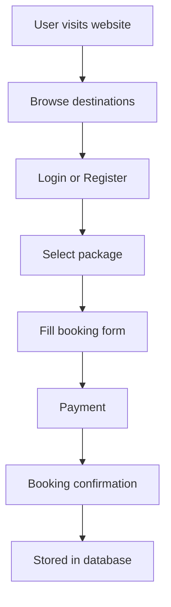
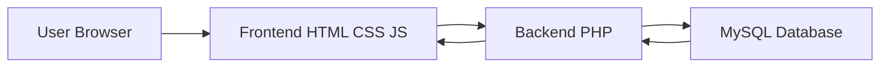

# ✈️ Saffron Tourism

### 🌍 Full-Stack Travel Booking Platform

<p align="center">
  
  
  
  
</p>

<p align="center">
  <b>From browsing → booking → payment → confirmation</b><br/>
  A complete end-to-end travel booking experience
</p>

---

## 🚀 What is Saffron Tourism?

Saffron Tourism is a **full-stack travel booking system** that enables users to:

* 🌍 Explore destinations
* 👤 Register & manage accounts
* 🧳 Book travel packages
* 💳 Complete payments
* 📊 Track booking history

👉 Built as a **real-world transactional system**, not just static pages.

---

## 🎯 Problem → Solution

| 🚨 Problem               | ⚡ Solution                  |
| ------------------------ | --------------------------- |
| Manual booking processes | Online booking system       |
| Scattered customer data  | Centralized database        |
| Payment delays           | Integrated payment workflow |
| Limited accessibility    | Web-based platform          |

---

## 🧩 Core Features

### 👤 User System

* Login / Registration
* Session management
* Profile dashboard

### 🧳 Booking Engine

* Select destination
* Enter travel details
* Confirm reservation

### 💳 Payment Workflow

* Secure payment form
* Booking summary
* Success confirmation

### 📩 Interaction Layer

* Contact form
* Email subscription

---

## 🎬 User Flow



---

## 🏗️ System Architecture



---

## 🗄️ Database Design

Relational database ensures **structured and consistent data handling**:

### Core Entities:

* Users
* Bookings
* Payments
* Contact Messages
* Subscribers

### Relationships:

* User → Booking (1:N)
* Booking → Payment (1:1)
* User → Contact / Subscription

---

## 🛠️ Tech Stack

<p align="center">
  
</p>

### Frontend

* HTML
* CSS
* JavaScript

### Backend

* PHP

### Database

* MySQL

---

## ⚙️ How It Works

```text
User Input
   ↓
Frontend (HTML/CSS/JS)
   ↓
Backend (PHP Processing)
   ↓
MySQL Query Execution
   ↓
Response Returned
   ↓
UI Updated
```

---

## 🎥 Demo — Booking to Payment Flow

<p align="center">
  
</p>

### Flow Covered:

* Browse destinations
* Select package
* Fill booking form
* Complete payment
* View confirmation

---

## 📁 Project Structure

```bash
project-root/
│── index.html
│── login.php
│── register.php
│── booking.php
│── payment.php
│── contact.php
│── assets/
│   └── demo.gif
```

---

## ✨ Engineering Highlights

* Session-based authentication
* Form validation & error handling
* Booking + payment integration
* Structured relational database
* Full frontend ↔ backend communication

---

## 🔮 Future Enhancements

* 💳 Real payment gateway integration
* 🛠️ Admin dashboard
* 📧 Email confirmations
* 📅 Availability calendar
* ⭐ Reviews & ratings
* 🌍 Multi-language support
* 📱 Mobile / PWA version
* 🔐 Enhanced security

---

## 💬 Key Insight

> This is not just a website —
> it is a **complete data-driven booking system with real-world flow**.

---

## 👨‍💻 Contributors

* Vedant Palande
* Ojas Singh
* Drishti Pachchigar

---

## 📄 License

MIT License
